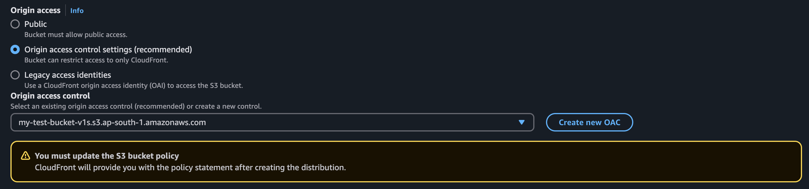
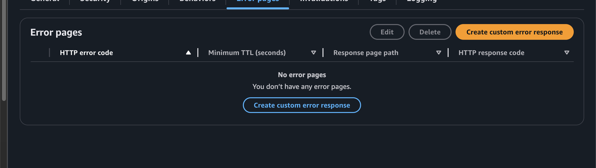
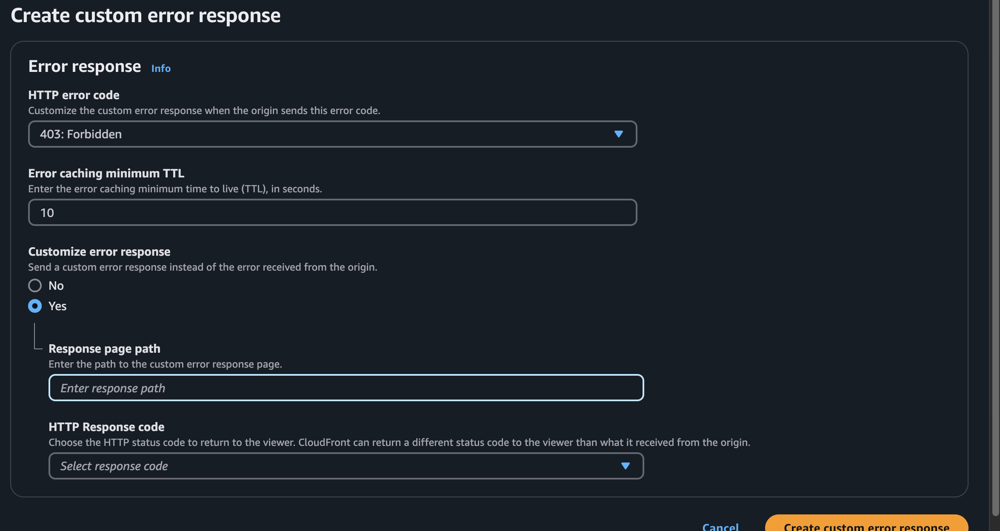
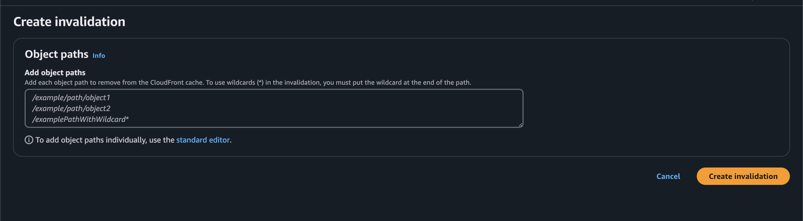

# S3
- (simple storage service)
- A scalable, highly available cloud-based storage service provided by Amazon Web Services
- It is used for storing and retrieving any amount of data, from anywhere on the internet
- Object Storage: Stores data as objects in buckets, identified by unique keys.

# CDN (Content delivery networks )
- CDNs are networks of distributed servers strategically located around the globe to deliver content to users more quickly and efficiently.

- Instead of fetching content from a single origin server, CDNs cache and serve content from servers closer to the user’s geographical location.

- CDN providers set up  Point of Presence (PoP)

# How to create s3 bucket

- create a project or have a project (it shouldn't be Server-Side Rendering (SSR) shouldn't have a server should be static file)
- create a build of the project eg npm run build
- Dist folder will be created now add this into you AWS s3 bucket (i.e dont copy the dist folder copy the content of dist folder in the s3 bucket)

- We cannot directly serve this s3 bucket , we can but it is very expensive and slow to have s3 buckets all around the world there fore we
use CDN (couldfront in AWS)

- For creating s3 bucket :
 - origin path - give the path of s3 url
 - Add the Origin access :
 

  - select Origin access control settings 

- Now you will have to do the changes in s3 bucket policy , (i.e it will give you a policy which is needed to be added in s3->permissions->bucket policy)

As now you website can be deployed

# How to change the domain name to the one you have 

- CDN (cloud front)-> settings ->  add alternate domains 
- need to verify whether the you have the DNS verify the DNS i.e : verify HTTPS for that you need certificate
- then map the DNS to the domain name you want to match to 

# How to handle invalid urls 
- if we dont handle these then if user hits any invalid URL it will give access error :
- Add custom error here :

- Add the changes you want :

# now check if it refreshes but it wont as CDN's are cached therefore we need to create Invalidations

- addd /* here for removing chache