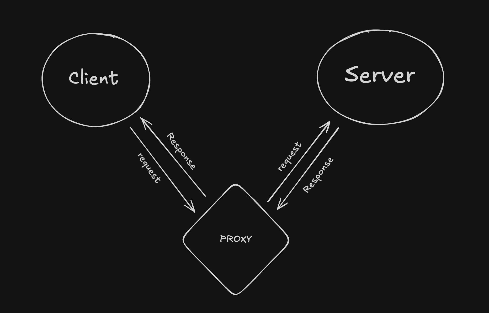
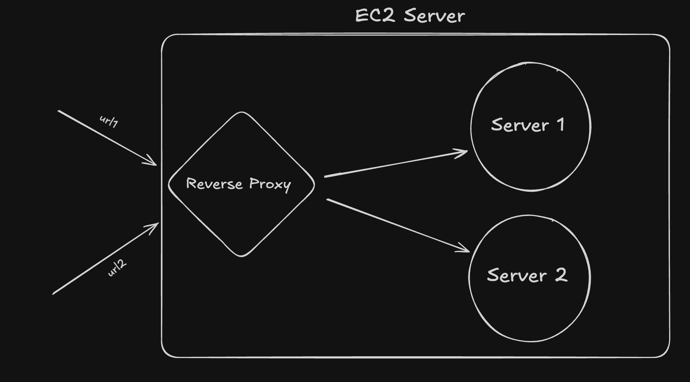

# AWS

- How to SSH (Secure Shell) or login into your server 
ssh -i sanchit-test.pem ubuntu@13.234.111.39
ssh -i <name-of-pem-file> <type-of-OS-running>@<IP-of-server>

- How to exit a ssh environment 
exit

- if we cannot connect to the internet in the ssh then we have to modify this file 
 go into this file 

 sudo vi /etc/resolv.conf

 click I to go in insert mode 
 add "nameserver 8.8.8.8"
 :qw
 to save and quit 
 :w to save
 :q! to quit 

- How to give read write execute permission to a file

eg : chmod rwxr-xr-- <filename>

here there are 9 characters divided in 3 sets

 - rwx - read write execute 
 - r-x - read execute
 - r-- read

 we can also represent it with numbers 
 - r = 4 
 - w = 2
 - x = 1

 so chmod rwxr-xr-- <filename> can be written in chmod 754 <filename>

 then we can clone our git directory on the system and after that as the aws system doesn't have node we install node an run our project

 if your port is something like 8080 then on aws console you will have to go to security and add new inbounds for 8080 port 

 # Proxy and reverse Proxy

 - Proxy 
 A proxy server acts as an intermediary between a client and a server. It forwards client requests to the server and sends the server's response back to the client.

 

 - Reverse Proxy
 A reverse proxy is placed in front of servers to intercept client requests and forward them to the appropriate server. It acts as an intermediary between the client and multiple backend servers.

# for Reverse proxy

- Go to your domain provider and add dns and map it to the domain

- Now for testing reverse Proxy

go to the nginx config file : sudo vi /etc/nginx/nginx.conf

- Delete default config sudo rm /etc/nginx/nginx.conf

- Enter this :

 \`` events {
    # Event directives...
}

http {
	server {
    listen 80;
    server_name be1.100xdevs.com;

    location / {
        proxy_pass http://localhost:8080;
        proxy_http_version 1.1;
        proxy_set_header Upgrade $http_upgrade;
        proxy_set_header Connection 'upgrade';
        proxy_set_header Host $host;
        proxy_cache_bypass $http_upgrade;
    }
	}
}
\`

- Restart ngnix
sudo nginx -s reload

- if i want to keep running my node process after closing the connection

- install project manager 
npm i -g pm2 ( this is project manager i.e need to know more about it)

- pm2 start index.js